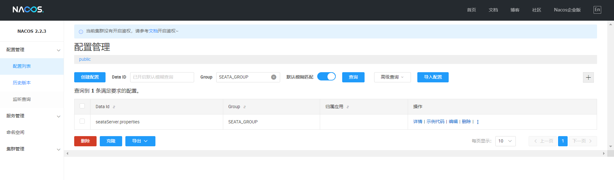
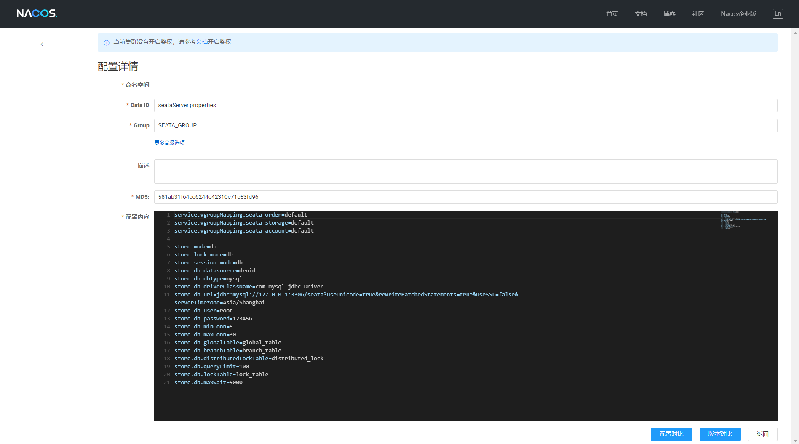
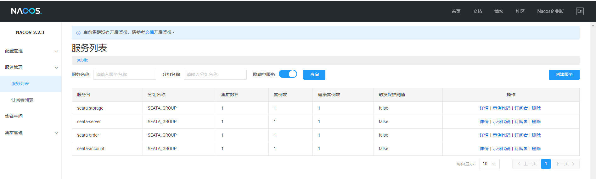

## 服务治理组件-分布式事务处理 Seata 示例学习

### 一、概述
Seata官网：https://seata.io/zh-cn/index.html

常见的分布式事务解决方案
从是否满足事务 ACID 特性上，我们可以将事务分为两大类：刚性事务和柔性事务。在常见解决方案中 XA 事务属于刚性事务解决方案，而其他的大多数解决方案如 TCC、Saga、消息最终一致性则属于柔性事务解决方案。以下将对几种常见的事务方案做简要的介绍：
消息最终一致性
消息最终一致性方案是在 Seata 问世之前，市面上应用最广泛的一种解决方案。它本身具有削峰填谷，可异步化的优点，更多的适应于可异步化的末端链路消息通知场景。但是它本身也存在着一些缺点：需要依赖可靠消息组件，消息的可靠性很重要，大多数的原生消息组件故障时很难降级；实时性比较差，要经过多次网络 IO 开销和持久化，遇到队列积压情形实时性不可控；无法保证隔离性，在已发送消息和消息消费之前，中间数据对外可见，

>分布式事务
无法满足事务 isolate 特性；只能向前重试不可向后回滚，消息消费无法成功时无法回滚
消息生产侧的数据；无法保证多条消息间的数据一致性。
**XA**
XA 标准提出后的 20 多年间未能得到持续的演进，在学术界有协议优化和日志协同处
理等相关的研究，在工业界使用 XA 落地方案的相对较少，主要集中在应用服务器的场景。
XA 方案要求相关的厂商提供其具体协议的实现，目前大部分关系数据库支持了 XA 协议，
但是支持程度不尽相同，例如，MySQL 在 5.7 才对 xa_prepare 语义做了完整支持。
XA 方案被人诟病的是其性能，其实更为严重的是对于连接资源的占用，导致在高并发未有
足够的连接资源来响应请求成为系统的瓶颈。在微服务架构下 XA 事务方案随着微服务链
路的扩展成为一种反伸缩模式，进一步加剧了资源的占用。另外 XA 事务方案要求事务链
路中的 resource 全部实现 XA 协议方可使用，若其中某一资源不满足，那么就无法保证整
个链路的数据一致性。
**TCC**
TCC 方案要求用户根据业务场景实现 try，confirm，cancel 三个接口，由框架根据
事务所处的事务阶段和决议来自动调用用户实现的三个接口。从概念上 TCC 框架可以认为
是一种万能框架，但是其难点是业务对于这三个接口的实现，开发成本相对较高，有较多业
务难以做资源预留相关的逻辑处理，以及是否需要在预留资源的同时从业务层面来保证隔离
性。因此，这种模式比较适应于金融场景中易于做资源预留的扣减模型。
**Saga**
有了 TCC 解决方案为什么还需要 Saga 事务解决方案？上文提到了 TCC 方案中
对业务的改造成本较大，对于内部系统可以自上而下大刀阔斧的推进系统的改造，但对于第
三方的接口的调用往往很难推动第三方进行 TCC 的改造，让对方为了你这一个用户去改
造 TCC 方案而其他用户并不需要，需求上明显也是不合理的。要求第三方业务接口提供
正反接口比如扣款和退款，在异常场景下必要的数据冲正是合理的。另外，Saga 方案更
加适应于工作流式的长事务方案并且可异步化。
上面提到了 4 种常用的分布式事务解决方案，Seata 集成了 TCC、Saga 和 XA 方
案。另外，Seata 还提供了独创的 AT 强一致分布式事务解决方案。


相关博文参考：

SpringCloud之Seata（一）
https://blog.csdn.net/qq_45738250/article/details/126214367

SpringCloud实战｜8.SpringCloud 整合 seata1.3-估计是全网讲的最细的并且一次成功的
https://zhuanlan.zhihu.com/p/449867990

seata的部署和集成（Spring Cloud）
https://blog.csdn.net/JiMoXiaoHunRen/article/details/130970955

SpringCloud+Nacos集成Seata-1.7.0分布式事务
https://article.juejin.cn/post/7257713854745395255


**示例概述**

| 模块                      | 应用名称      | HTTP端口 | MySQL库       | MySQL表                                                  | 备注      |
| ------------------------- | ------------- | -------- | ------------- | -------------------------------------------------------- | --------- |
| Seata Server              | seata-server  | 7091     | seata         | lock_table，global_table，branch_table，distributed_lock | seata服务 |
| springcloud-seata-account | seata-account | 2001     | seata_account | t_account，undo_log                                      | 账户示例  |
| springcloud-seata-storage | seata-storage | 2002     | seata_storage | t_storage，undo_log                                      | 库存示例  |
| springcloud-seata-order   | seata-order   | 2003     | seata_order   | t_order，undo_log                                        | 订单示例  |

**示例流程：**

在MySQL Server、Nacos Server和 Seata Server 先后启动成功后，

再启动seata-account、seata-storage服务，

最后启动seata-order服务。

然后 通过访问seata-order服务中的地址 http://localhost:2003/order/createOrder 来验证Seata事务特性。

订单创建成功时会扣除账户余额和扣减产品库存，

可以通过修改seata-order程序中的订单金额(大于账户余额)方式验证订单创建失败场景。


### 二、依赖版本信息
* JDK1.8

* SpringBoot:2.1.17.RELEASE

* SpringCloud:Greenwich.RELEASE

* SpringCloudAlibaba:2.1.2.RELEASE

* Nacos-Server 2.2.3

* Seata-Server 1.7.0

* MySQL5.7服务


### 三、部署启动 Seata Server


#### 3.1.下载安装Seata Server

通过Seata官网下载Seata-Server 1.7.0 https://seata.io/zh-cn/blog/download.html

```
部署包中相关重要文件
seata
--conf\application.example.yml --示例配置文件
--conf\application.yml
--script\config-center\config.txt --nacos配置(seataServer.properties)参考内容
--script\server\db\mysql.sql --相关初始表
```

#### 3.2.修改application.yml配置

注意：配置文件中的data-id: seataServer.properties对应的就是Nacos配置中心的配置ID。同时各客户端模块也需要显示指定data-id。

```yaml
server:
  port: 7091

spring:
  application:
    name: seata-server

logging:
  config: classpath:logback-spring.xml
  file:
    path: ${user.home}/logs/seata

console:
  user:
    username: seata
    password: seata
seata:
  config:
    # support: nacos 、 consul 、 apollo 、 zk  、 etcd3
    type: nacos
    nacos:
      server-addr: 127.0.0.1:8848
      namespace: "public"
      group: SEATA_GROUP
      username:
      password:
      context-path:
      ##if use MSE Nacos with auth, mutex with username/password attribute
      #access-key:
      #secret-key:
      data-id: seataServer.properties
  registry:
    # support: nacos, eureka, redis, zk, consul, etcd3, sofa
    type: nacos
    nacos:
      application: seata-server
      server-addr: 127.0.0.1:8848
      group: SEATA_GROUP
      namespace: "public"
      cluster: default
      username:
      password:
      context-path:
      ##if use MSE Nacos with auth, mutex with username/password attribute
      #access-key:
      #secret-key:
  store:
    # support: file 、 db 、 redis
    mode: db
    session:
      mode: db
    lock:
      mode: db
    db:
      datasource: druid
      db-type: mysql
      driver-class-name: com.mysql.jdbc.Driver
      url: jdbc:mysql://127.0.0.1:3306/seata?useUnicode=true&rewriteBatchedStatements=true&useSSL=false&serverTimezone=Asia/Shanghai
      user: root
      password: 123456
      min-conn: 10
      max-conn: 100
      global-table: global_table
      branch-table: branch_table
      lock-table: lock_table
      distributed-lock-table: distributed_lock
      query-limit: 1000
      max-wait: 5000
#  server:
#    service-port: 8091 #If not configured, the default is '${server.port} + 1000'
  security:
    secretKey: SeataSecretKey0c382ef121d778043159209298fd40bf3850a017
    tokenValidityInMilliseconds: 1800000
    ignore:
      urls: /,/**/*.css,/**/*.js,/**/*.html,/**/*.map,/**/*.svg,/**/*.png,/**/*.jpeg,/**/*.ico,/api/v1/auth/login
```


#### 3.3.在nacos配置中增加seataServer.properties配置

(其他配置从seata\script\config-center\config.txt复制即可)

```properties
service.vgroupMapping.seata-order=default
service.vgroupMapping.seata-storage=default
service.vgroupMapping.seata-account=default

store.mode=db
store.lock.mode=db
store.session.mode=db
store.db.datasource=druid
store.db.dbType=mysql
store.db.driverClassName=com.mysql.jdbc.Driver
store.db.url=jdbc:mysql://127.0.0.1:3306/seata?useUnicode=true&rewriteBatchedStatements=true&useSSL=false&serverTimezone=Asia/Shanghai
store.db.user=root
store.db.password=123456
store.db.minConn=5
store.db.maxConn=30
store.db.globalTable=global_table
store.db.branchTable=branch_table
store.db.distributedLockTable=distributed_lock
store.db.queryLimit=100
store.db.lockTable=lock_table
store.db.maxWait=5000
```







#### 3.4.启动seta-server

D:\baseServer\seata\bin\seata-server.bat

浏览器访问Seata控制台： http://127.0.0.1:7091/


### 四、配置实现

#### 4.1 pom.xml配置支持Nacos、Seata、MyBatis-Plus、MySQL

注意：尽量依赖的seata jar版本与部署seata server服务版本保持一致。
```xml
	<dependencies>
  <dependency>
    <groupId>org.springframework.boot</groupId>
    <artifactId>spring-boot-starter-web</artifactId>
  </dependency>
  <dependency>
    <groupId>org.springframework.boot</groupId>
    <artifactId>spring-boot-starter-data-jdbc</artifactId>
  </dependency>
  <dependency>
    <groupId>com.alibaba.cloud</groupId>
    <artifactId>spring-cloud-starter-alibaba-nacos-discovery</artifactId>
    <version>${spring-cloud-alibaba.version}</version>
  </dependency>
  <dependency>
    <groupId>org.springframework.cloud</groupId>
    <artifactId>spring-cloud-starter-openfeign</artifactId>
  </dependency>

  <dependency>
    <groupId>com.alibaba.cloud</groupId>
    <artifactId>spring-cloud-starter-alibaba-seata</artifactId>
    <exclusions>
      <exclusion>
        <groupId>io.seata</groupId>
        <artifactId>seata-spring-boot-starter</artifactId>
      </exclusion>
    </exclusions>
  </dependency>
  <dependency>
    <groupId>io.seata</groupId>
    <artifactId>seata-spring-boot-starter</artifactId>
    <version>1.7.0</version>
  </dependency>

  <dependency>
    <groupId>org.springframework.boot</groupId>
    <artifactId>spring-boot-starter-test</artifactId>
    <scope>test</scope>
  </dependency>
  <dependency>
    <groupId>org.projectlombok</groupId>
    <artifactId>lombok</artifactId>
  </dependency>

  <dependency>
    <groupId>com.baomidou</groupId>
    <artifactId>mybatis-plus-boot-starter</artifactId>
    <version>3.5.3.2</version>
  </dependency>
  <dependency>
    <groupId>com.mysql</groupId>
    <artifactId>mysql-connector-j</artifactId>
    <version>8.1.0</version>
  </dependency>
</dependencies>
```

#### 4.2 启动类增加注解支持
```java
@MapperScan("org.jeedevframework.springcloud.mapper")
@EnableDiscoveryClient
@EnableFeignClients
@SpringBootApplication
public class SpringcloudSeataOrderApplication {

  @Bean
  @LoadBalanced
  RestTemplate restTemplate(){
    return new RestTemplate();
  }

  public static void main(String[] args) {
    SpringApplication.run(SpringcloudSeataOrderApplication.class, args);
  }
}

```

#### 4.3 配置 application.yml
```yaml
server:
  port: 2003
spring:
  application:
    name: seata-order
  cloud:
    nacos:
      discovery:
        server-addr: 127.0.0.1:8848
        namespace: "public"
        group: SEATA_GROUP
      config:
        server-addr: ${spring.cloud.nacos.discovery.server-addr}
        file-extension: yaml
  datasource:
    type: com.alibaba.druid.pool.DruidDataSource
    jdbcUrl: jdbc:mysql://localhost:3306/seata_order?useUnicode=true&characterEncoding=utf8&useSSL=false&serverTimezone=Asia/Shanghai&autoReconnect=true
    url: ${spring.datasource.jdbcUrl}
    driverClassName: com.mysql.cj.jdbc.Driver
    username: root
    password: 123456

mybatis:
  config-location: classpath:mybatis/mybatis-config.xml

mybatis-plus:
  mapper-locations: classpath:mybatis/mapper/*Mapper.xml
  configuration:
    map-underscore-to-camel-case: true
    cache-enabled: false
    log-impl: org.apache.ibatis.logging.stdout.StdOutImpl

#Seata分布式事务配置(AT模式)
seata:
  enabled: true
  application-id: ${spring.application.name}
  #客户端和服务端在同一个事务组
  tx-service-group: seata-order
  enable-auto-data-source-proxy: true
  service:
    vgroup-mapping:
      seata-order: default
  config:
    type: nacos
    nacos:
      namespace: "public"
      serverAddr: 127.0.0.1:8848
      group: SEATA_GROUP
      data-id: seataServer.properties
      #username: "nacos"
      #password: "nacos"
  #服务注册到nacos
  registry:
    type: nacos
    nacos:
      application: seata-server
      server-addr: 127.0.0.1:8848
      group: SEATA_GROUP
      namespace: "public"
      #username: "nacos"
      #password: "nacos"
      cluster: default
```

注意：配置文件中的data-id: seataServer.properties对应的就是Seata Server配置文件中指定的以及Nacos配置中心配置的data-id


#### 4.4 初始化seata_storage库中数据表

```sql
USE seata_order;

CREATE TABLE `t_order` (
   id int(11) NOT NULL AUTO_INCREMENT,
   user_id bigint(20) NOT NULL,
   product_id bigint(20) NOT NULL,
   money int(11) NOT NULL,
   count int(11) NOT NULL,
   status int(11) NOT NULL,
   PRIMARY KEY (`id`),
   KEY `idx_user_id` (`user_id`),
   KEY `idx_product_id` (`product_id`)
) ENGINE=InnoDB DEFAULT CHARSET=utf8mb4;

INSERT INTO `t_storage` (`id`, `product_id`, `count`) VALUES (1, 1, 500);
INSERT INTO `t_storage` (`id`, `product_id`, `count`) VALUES (2, 2, 600);

CREATE TABLE `undo_log` (
  `branch_id` bigint(20) NOT NULL COMMENT 'branch transaction id',
  `xid` varchar(128) NOT NULL COMMENT 'global transaction id',
  `context` varchar(128) NOT NULL COMMENT 'undo_log context,such as serialization',
  `rollback_info` longblob NOT NULL COMMENT 'rollback info',
  `log_status` int(11) NOT NULL COMMENT '0:normal status,1:defense status',
  `log_created` datetime(6) NOT NULL COMMENT 'create datetime',
  `log_modified` datetime(6) NOT NULL COMMENT 'modify datetime',
  UNIQUE KEY `ux_undo_log` (`xid`,`branch_id`)
) ENGINE=InnoDB DEFAULT CHARSET=utf8mb4 COMMENT='AT transaction mode undo table';
```


#### 4.5 编写seata-storage相关实现

包括:
* Order.java
* OrderMapper.java
* OrderService.java
* OrderServiceImpl.java
* OrderController.java

### 五、 测试准备
* 启动 nacos-server(服务治理中心)
  Windows: D:/opt/soft/nacos/bin/startup.cmd -m standalone
  Linux: sh /opt/soft/nacos/bin/startup.sh -m standalone
* 启动 seata-server(分布式事务管理服务)
  Windows: D:\baseServer\seata\bin\seata-server.bat
  Linux: sh /opt/soft/seata/bin/startup.sh
* 启动seata-account和seata-storage服务
* 访问 http://localhost:8084/nacos 服务注册中心，查看相关服务是否已注册(seata-server,seata-account,seata-storage)




### 六、 测试
* 启动 Application (springcloud-seata-order)
* 访问 服务接口 http://localhost:2003/order/listAll 正确返回订单数据即为成功
* 访问 服务接口 http://localhost:2003/order/createOrder 返回"订单创建成功"即为订单创建成功；
  分别查看seata_account.t_account、seata_storage.t_storage和seata_order.t_order表中数据变化是否正确。
* 修改OrderServiceImpl.java中订单金额为20000（大于账户余额即可)；
   再次访问 http://localhost:2003/order/createOrder 返回"订单创建失败,账户余额不足！"，同时再次查看相关表，期望数据没有变化(正确回滚)。